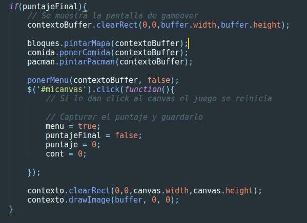

# Pacman
Clásico juego del come-galletas

## Manejo del puntaje
En el script "juego.js" hay una variable llamada puntaje  
Que se puede capturar cuando el usuario le da click al canvas para volver a reiniciar el juego  

## Integrantes
- Carlos López
- Alejandro Morales
- Juan Arias
